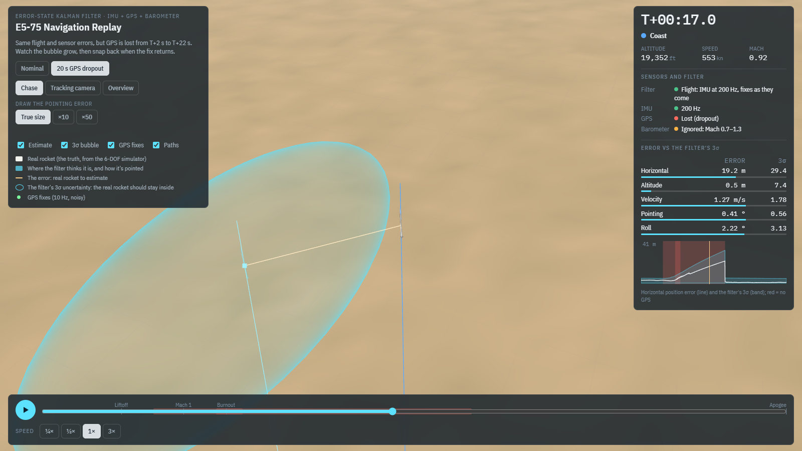
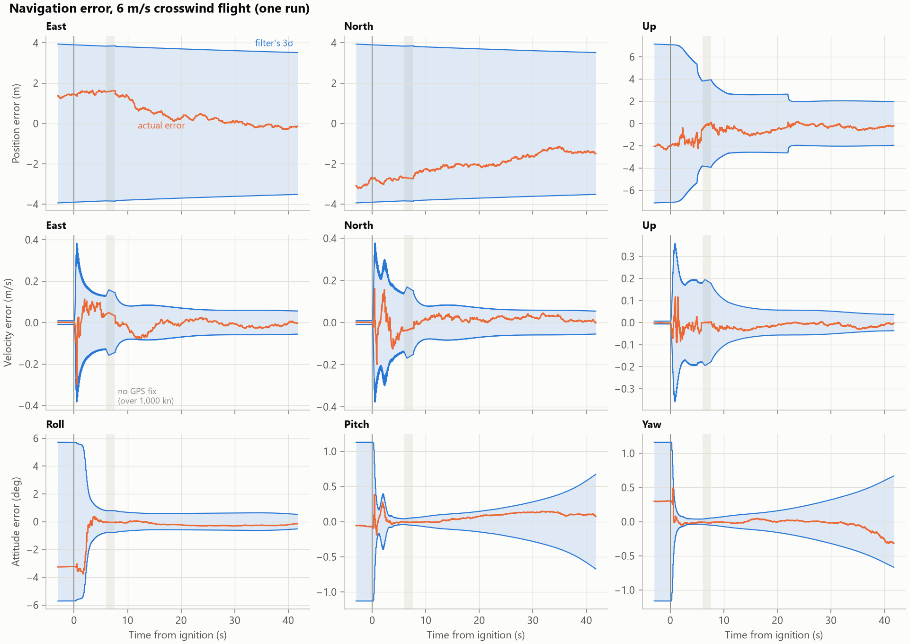
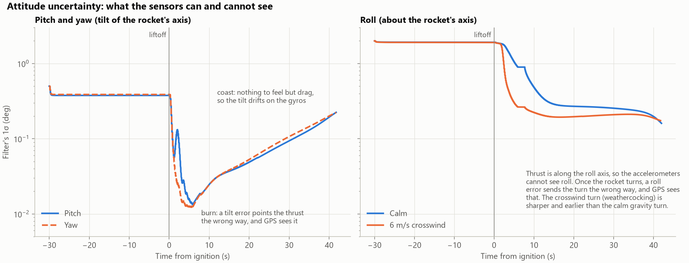
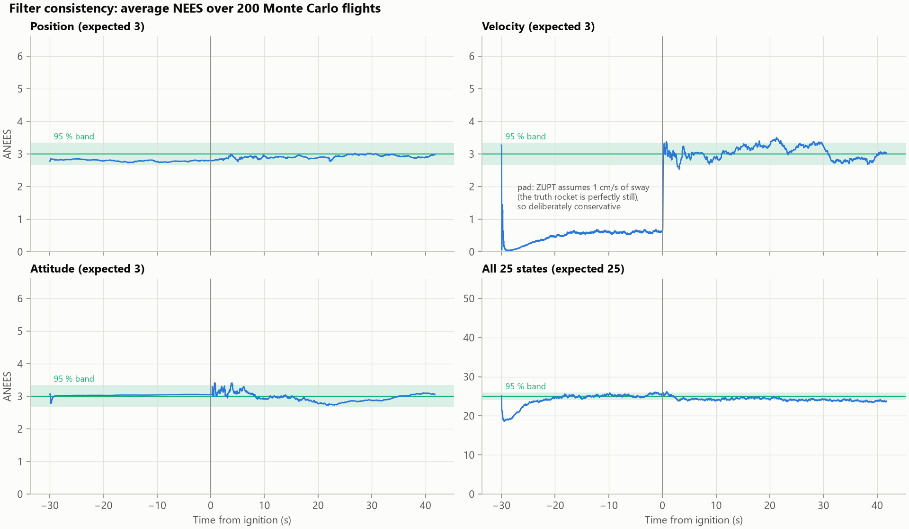
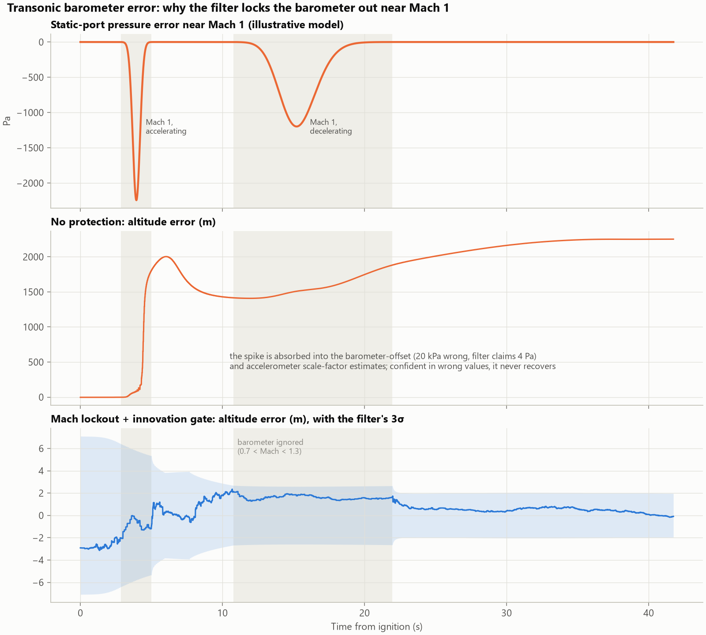
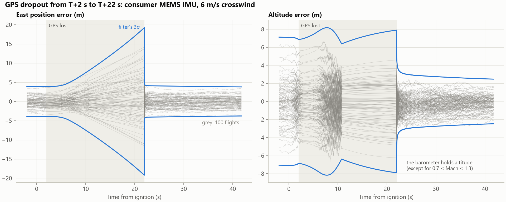
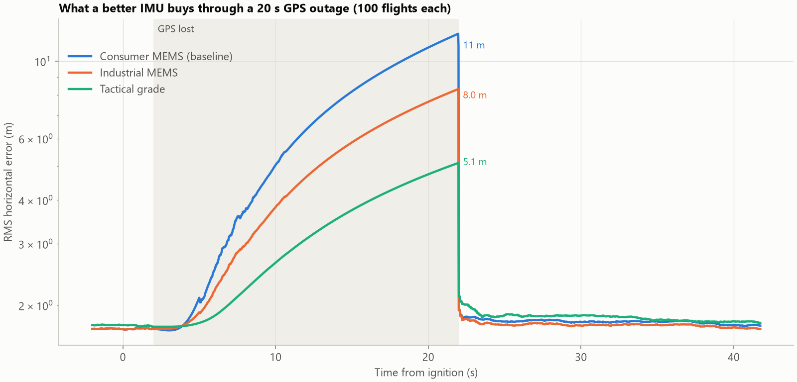
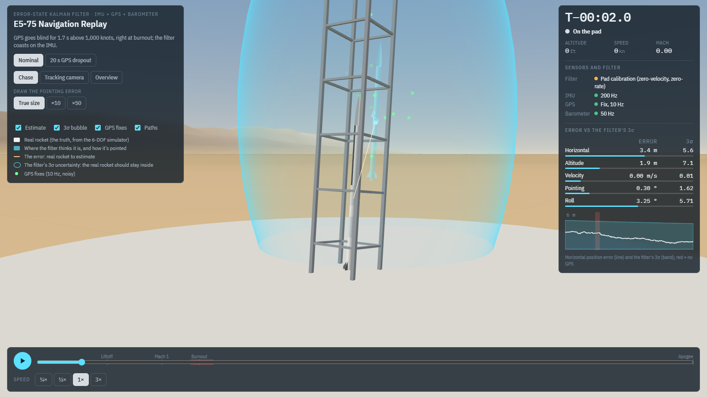
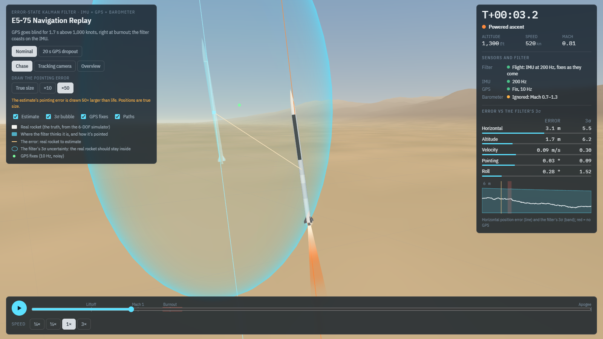
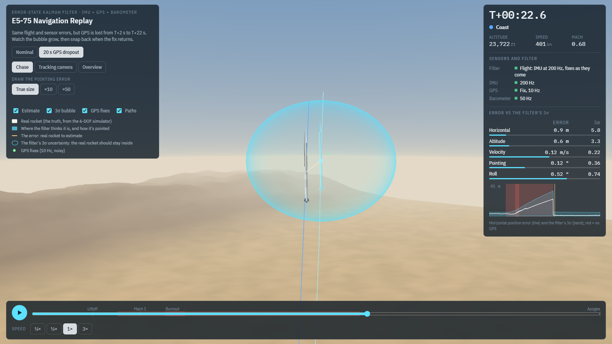

# Rocket Navigation: Error-State Kalman Filter (IMU + GPS + Barometer)

Part 1 of a guidance, navigation and control (GNC) project. This is the
navigation system for the liquid sounding rocket from my
[6-DOF Flight Simulator](https://github.com/momokazmi1017/FlightSim6DOF), which
is powered by the E5-75 engine from my
[Liquid Rocket Engine Design Tool](https://github.com/momokazmi1017/LiquidRocketEngineprelimdesigntool).

The flight computer has three cheap sensors: a MEMS IMU (accelerometers and
gyros), a GPS receiver and a barometer. None of them alone tells it where the
rocket is and which way it points. An **error-state extended Kalman filter**
fuses them into position, velocity and attitude from the pad to apogee (30,000 ft,
Mach 1.7), and reports how uncertain each estimate is.

The pipeline:
1. **Truth**: fly the rocket in the 6-DOF simulator (project 2) and export the
   trajectory at 200 Hz.
2. **Sensors**: turn the truth into realistic sensor readings: noise, biases,
   scale-factor errors, GPS errors that wander over time, a GPS speed limit,
   and barometer errors near Mach 1.
3. **Filter**: a 25-state error-state EKF with pad calibration, measurement
   gating and a barometer lockout near Mach 1.
4. **Prove it's honest**: 200 Monte Carlo flights check that the errors really
   are as big as the filter says (NEES consistency test). Then a GPS dropout,
   an IMU-grade trade, and five design trades that each remove one filter
   feature.

Every model is checked against exact answers first (see [Validation](#validation)).

**[▶ Watch the filter fly in 3D](https://momokazmi1017.github.io/RocketNavigationEKF/viewer/nav_viewer.html)**
(interactive replay in the browser; see [3D navigation replay](#3d-navigation-replay))





## Results at a glance

200 Monte Carlo flights of the 6 m/s crosswind mission, each with fresh sensor errors:

| Result | Value |
|---|---|
| Position error at apogee (RMS, 3D) | **1.8 m** (at 9.1 km altitude) |
| Velocity error at apogee (RMS, 3D) | 0.03 m/s |
| Axis-pointing error at apogee (RMS) | 0.30° (0.015° 1σ at burnout) |
| Errors inside the filter's ±3σ | **99.7 %** (99.73 % expected for a Gaussian) |
| Consistency, average NEES per state (1.00 = honest) | position 0.97, velocity 1.01, attitude 0.99, all 25 states 0.97 |
| 20 s GPS outage through burnout: horizontal error when the fix returns | 11 m RMS (filter predicted 11.8 m); back to 1.8 m within 3 s |
| Speed | 72 s of flight (30 s on the pad + 42 s to apogee) filtered in about 1 s of Python |

## Sensors

`gnc/sensors.py`. The numbers are representative of the parts flown on student
rocket avionics. They are assumptions, not one specific datasheet.

| Sensor | Rate | Errors modelled (1σ) |
|---|---|---|
| Accelerometer (MEMS, ±16 g) | 200 Hz | Noise 100 µg/√Hz; turn-on bias 10 mg plus random walk; scale factor 0.3 %; saturation |
| Gyro (MEMS, ±2000 °/s) | 200 Hz | Noise 0.005 °/s/√Hz; turn-on bias 0.5 °/s plus random walk; scale factor 0.3 %; saturation |
| GPS | 10 Hz | Position: 0.5 m / 1.0 m white noise (horizontal / vertical) plus a **Gauss-Markov error** that wanders 1.5 m / 3 m with a 60 s correlation time. Velocity: 0.15 / 0.3 m/s. **No fix above 1,000 knots** (the export-control "CoCom" limit). |
| Barometer (static pressure) | 50 Hz | Noise 2.5 Pa (about 0.2 m at the pad); unknown offset 300 Pa (the day's weather vs the standard atmosphere); **static-port error near Mach 1**, Δp = C<sub>p</sub>(M)·q̄, peaking at 4 % of dynamic pressure (an illustrative magnitude) |

Two of these matter a lot on this flight:
- The rocket passes 1,000 knots (514 m/s) from T+5.95 s to T+7.63 s, so **the GPS
  goes blind right at burnout and maximum speed**.
- It crosses Mach 1 twice, climbing (T+3.9 s) and coasting (T+15.5 s). The
  barometer is badly wrong both times, by up to 2.2 kPa (the equivalent of
  about 200 m of altitude).

## The filter

`gnc/ekf.py`, `gnc/navigation.py`

**Two layers.** The *nominal state* is dead-reckoned from the IMU at 200 Hz:
the attitude quaternion is rotated by the gyro rates, the specific force is
rotated into the navigation frame, gravity is added, and the result is
integrated (strapdown mechanization). The *error state* is the difference
between that estimate and the truth. Errors stay small, so their dynamics are
linear and a Kalman filter can track them:

| Error state | Count | Why it's there |
|---|---|---|
| Position, velocity (East-North-Up) | 6 | What we want |
| Attitude (small rotation vector, body axes) | 3 | Tilting the thrust by δθ makes a velocity error that grows like thrust × δθ |
| Accelerometer and gyro biases | 6 | They differ at every power-up, and drift |
| Accelerometer and gyro scale factors | 6 | Under 10 g of thrust, a 0.3 % gain error is 0.03 g |
| GPS position wander (Gauss-Markov) | 3 | GPS errors are correlated over about a minute, not white noise |
| Barometer offset | 1 | The day's pressure is not the standard atmosphere |

The key line of physics is the velocity-error equation,
δv̇ = −R [f]<sub>×</sub> δθ − R δb<sub>a</sub> − R diag(f) δs<sub>a</sub> + …
An attitude error tips the measured thrust vector f, and the rocket's velocity
error grows accordingly. That is also *why* GPS can measure attitude: only
while there is a force to tip.

**Timeline, as the flight computer runs it:**

| Phase | What the filter does |
|---|---|
| On the pad (30 s) | Starts from the surveyed rail angle (±0.5° tilt, ±2° roll). **Zero-velocity (ZUPT)** and **zero-rate (ZARU)** updates at 10 Hz: the rocket is not moving, so the gyros read only their biases, and the accelerometers level the rocket against gravity. GPS and barometer calibrate each other. |
| Liftoff | Detected when the accelerometers read over 1.2 g for 3 samples in a row (at T+0.075 s). Pad updates stop. |
| Flight | IMU prediction at 200 Hz, GPS at 10 Hz when it has a fix, barometer at 50 Hz except when **0.7 < Mach < 1.3** (lockout, using the filter's own Mach estimate). Every measurement first passes a **chi-square innovation gate** (99.99 %). |

Updates use the Joseph form of the covariance update, and the attitude error
is reset properly after each correction.

## Nominal flight

`python examples/nav_nominal.py`: one crosswind flight, seed 7. The figure at
the top of this page shows its errors against the filter's own ±3σ bounds.

| | On the pad (T−1 s) | Burnout (T+6.6 s) | Apogee (T+41.7 s) |
|---|---|---|---|
| Position 1σ, East / North / Up (m) | 1.30 / 1.30 / 2.37 | 1.28 / 1.28 / 1.29 | 1.17 / 1.17 / 0.65 |
| Velocity 1σ (m/s) | 0.003 | 0.05–0.07 | 0.012–0.019 |
| Attitude 1σ, roll / pitch / yaw (°) | 1.90 / 0.38 / 0.39 | 0.26 / 0.015 / 0.015 | 0.17 / 0.22 / 0.22 |
| Accelerometer scale factor 1σ, along the thrust axis | 2,900 ppm (unknown) | **116 ppm** | 33 ppm |



**What the sensors can and cannot see.** On the pad, gravity levels the
rocket, but only to the accelerometer bias (10 mg of bias looks exactly like
0.57° of tilt). Under thrust, a pointing error sends the rocket the wrong way,
GPS sees it, and pitch/yaw collapse to 0.015° within 5 s. In coast, there is
no force to tip, so the tilt slowly drifts on the gyros. Roll (about the
thrust axis) is invisible to the accelerometers. It only becomes observable
once the rocket *turns*, because a roll error then sends the turn in the wrong
direction. The crosswind flight turns earlier and harder (weathercocking), so
roll is learned sooner than in calm air.

## Is the filter honest? Monte Carlo consistency

`python examples/nav_monte_carlo.py` (about 2 minutes on 24 cores)

A Kalman filter reports its own uncertainty P. It is **consistent** when the
real errors are as large as P says. An overconfident filter ignores good data
and can diverge; an underconfident one wastes it. The test (Bar-Shalom, Li &
Kirubarajan, *Estimation with Applications to Tracking and Navigation*, §5.4)
is the normalised estimation error squared, NEES = eᵀP⁻¹e, which should
average the number of states. Averaged over M independent runs (ANEES), it
must fall inside a chi-square band.



| 200 flights, T+0 to apogee | ANEES (expected) | 95 % band | Time steps inside the band |
|---|---|---|---|
| Position | 2.91 (3) | 2.66–3.36 | 100 % |
| Velocity | 3.04 (3) | 2.66–3.36 | 93 % |
| Attitude | 2.96 (3) | 2.66–3.36 | 99 % |
| All 25 states | 24.2 (25) | 23.6–26.4 | 64 % (slightly conservative) |

On the pad the velocity ANEES sits below the band on purpose. The zero-velocity
update assumes 1 cm/s of pad sway (a real rocket on a tower moves in the wind),
and the simulated rocket is perfectly still.

### Design trades: what each filter feature buys

Each row removes one feature and reruns 100 flights (same seeds). An ANEES of
3 means honest; far above 3 means the filter believes it is much more
accurate than it is.

| Filter | ANEES position / velocity / attitude | RMS position at apogee | Worst altitude error | RMS pointing error at apogee |
|---|---|---|---|---|
| **Baseline (everything below)** | **2.71 / 3.02 / 2.85** | **1.7 m** | **6.2 m** | **0.29°** |
| GPS error treated as white noise | 531 / 62 / 3.6 | 4.6 m | 10.5 m | 0.33° |
| No IMU scale-factor states | 6,448 / 11,633 / 20 (diverges) | 49 m | 122 m | 1.05° |
| No pad calibration (ZUPT / ZARU) | 2.70 / 3.18 / 3.76 | 1.8 m | 6.2 m | 1.16° |
| No barometer Mach lockout (gate only) | 5.25 / 5.87 / 3.53 | 1.7 m | 7.8 m | 0.35° |
| No lockout and no innovation gate | 10<sup>7</sup> (diverges) | 2,260 m | 2,290 m | 59° |



## GPS dropout

`python examples/gps_dropout.py` (about 1 minute)

The receiver loses its fix from T+2 s to T+22 s: through burnout, maximum
speed and most of the coast. The filter dead-reckons on the IMU, with only the
barometer (outside its transonic lockout) for altitude.



Each grey line is one of 100 flights. The spread grows as the filter
predicted and collapses when the fix returns at T+22 s. Over the 100 flights
the innovation gate rejected 4 of about 50,000 GPS fixes. A 99.99 % gate
should reject 1 in 10,000 honest readings, so it is not throwing away good data.

### IMU trade: what a better (more expensive) IMU buys



| IMU (representative) | Accel bias / gyro bias | Pointing error at liftoff | Horizontal error after the 20 s outage (RMS) | Filter's prediction |
|---|---|---|---|---|
| **Consumer MEMS (baseline)** | **10 mg / 0.5 °/s** | **0.54°** | **11.1 m** | **11.8 m** |
| Industrial MEMS | 2 mg / 0.1 °/s | 0.24° | 8.0 m | 9.1 m |
| Tactical grade | 0.3 mg / 1 °/h | 0.18° | 5.1 m | 5.3 m |
| Consumer MEMS, no GPS at all after liftoff | | 0.54° | 65 m at apogee | 71 m |

A tactical-grade IMU costs far more and buys only 2×.
The error is set mostly **on the pad**. The accelerometer bias limits how well
gravity can level the rocket. And gravity says nothing about the *direction*
of the rail's lean, so the rail survey limits the pointing error. Better rail
alignment would buy most of what the expensive IMU does.

## 3D navigation replay

**[Open the replay in your browser](https://momokazmi1017.github.io/RocketNavigationEKF/viewer/nav_viewer.html)**,
or download [`viewer/nav_viewer.html`](viewer/nav_viewer.html) and open it
locally. It is one self-contained file; three.js loads from a CDN. It extends
the [project 2 flight replay](https://momokazmi1017.github.io/FlightSim6DOF/viewer/flight_viewer.html).

| | |
|---|---|
|  |  |
| On the pad: calibrating, with the estimate 3 m off inside a tall bubble (GPS is worse vertically) | Mach 0.8: barometer locked out; the pointing error drawn 50× so it shows |
|  |  |
| 15 s without GPS: 19 m off, inside a flat 29 m bubble (the barometer still holds altitude) | 0.6 s after the fix returns: back to 0.9 m, the bubble collapsed |

- **The real rocket** flies the 6-DOF truth. **A translucent cyan rocket** flies
  where the filter thinks it is, and points where the filter thinks it points.
  A **yellow line** joins them: the estimation error.
- **The 3σ bubble** is the filter's own uncertainty ellipsoid (east, north, up)
  around its estimate. If the filter is honest, the real rocket stays inside.
- **Green dots** are the GPS fixes as they arrive, noise and all. They stop
  above 1,000 knots and during the dropout.
- **Live panel:** filter mode (pad calibration or flight), each sensor's status
  (fix / no fix / dropout; barometer used or locked out near Mach 1), and five
  errors next to their 3σ, with bars that should stay short of full.
- **Two scenarios:** the nominal crosswind flight, and the same flight (same
  sensor errors) with a 20 s GPS dropout.
- Position errors are always drawn true size. Attitude errors are fractions of
  a degree, so the pointing error can be drawn 10× or 50× larger.
- Links ending in `#pad`, `#boost`, `#blackout`, `#tracking` or `#recovery`
  open the replay paused at that moment.

Rebuild it after changing the filter: `python tools/build_viewer.py`.

## Findings

1. **The Monte Carlo caught a bias that single runs could not.** Early
   versions had a vertical-velocity bias of −0.7σ on average across 100 runs.
   The cause was the EKF's linearisation. Under 10 g of thrust, an unknown
   tilt δθ shortens the thrust's component along the true axis by about
   f·δθ²/2, whichever way it tilts. The only state that could absorb that
   steady error was the accelerometer bias, which then became biased. The
   textbook second-order mean correction (Gelb, §6.1) made it worse: it
   assumes the truth is scattered around the estimate, while here the truth
   is fixed and the estimates scatter around it. What fixed it was modelling
   the accelerometer **scale factor**, a real 0.3 % MEMS error I had left out.
   It is proportional to thrust, so it gives the filter the right place to put
   the error. A residual bias of about 0.5σ remains in coast.
2. **An overconfident filter locks out the data that would save it.** Without
   scale-factor states, the filter believes it is accurate, so its innovation
   gate rejects about half of the (correct) GPS fixes as outliers, and it
   diverges to 49 m.
3. **GPS errors are not white noise.** Treated as white, 30 s of pad averaging
   "shrinks" the position uncertainty to 0.1–0.2 m, and position ANEES reaches 531.
   Three Gauss-Markov states make it honest (1.3 m on the pad).
4. **The barometer must be switched off near Mach 1.** Unprotected, one
   transonic spike is absorbed into the barometer-offset and scale-factor
   estimates. The filter then trusts those wrong values and ends 2 km off. The
   gate alone is not enough: errors of 3–4σ at the edge of the transonic band
   slip through and make the filter overconfident (ANEES 5.9). A Mach lockout
   plus the gate solves it. The lockout band is 0.7–1.3: the modelled port
   error exceeds the barometer noise from Mach 0.75 to 1.27, plus a margin.
5. **The GPS goes blind exactly when things happen fastest.** Above 1,000
   knots (T+5.95 s to T+7.63 s: burnout and maximum speed), the filter runs on
   the IMU alone, which is why the scale-factor and pointing estimates learned
   during the burn matter.
6. **Pad calibration is worth 4× in pointing.** Without the zero-rate update,
   the 0.5 °/s gyro biases are never removed. The pointing error at apogee
   grows from 0.29° to 1.16°, and roll from 0.21° to 0.61°.

## Validation

| Check | Reference | Result |
|---|---|---|
| Atmosphere, 0–30 km | U.S. Standard Atmosphere 1976 tables | p and ρ within 0.1 % |
| Barometer Jacobian dp/dz = −ρg | Finite difference of the model | 10<sup>−5</sup> |
| Strapdown mechanization | Error-free IMU dead-reckoned against the 6-DOF truth, 42 s and 9 km | 2 mm, 0.07 mm/s, 10<sup>−8</sup> rad |
| Error-state Jacobian F (every term) | Finite difference of the nonlinear propagation: 0.2 s of powered flight with all 25 states perturbed; 10 s of coast from 100 m too high (gravity gradient) | agrees to second order; each term confirmed by breaking it on purpose |
| Kalman update | Closed-form scalar posterior σ²R/(σ²+R) | 10<sup>−9</sup> |
| Sensor models | Noise density N/√Δt; stationary Gauss-Markov σ; CoCom logic | within 5 % / 10 % / exact |
| Filter consistency | ANEES inside the chi-square 95 % band (48 runs in the test, 200 in the example) | passes |
| Errors inside ±3σ | 99.73 % for a Gaussian | 99.7 % |
| GPS dropout | Uncertainty grows without GPS, collapses when it returns, errors stay inside the bounds | passes |

All of these run as tests (`pytest`, 22 tests, about 15 s).

## Limitations

- **Truth model.** The truth is the project 2 simulator: a flat, non-rotating
  Earth. So the gyros never sense Earth's rotation (15 °/h). A tactical-grade
  IMU could use it to find north on the pad (gyrocompassing); here heading
  comes only from the rail survey.
- **Sensors.** Modelled: noise, turn-on bias, bias drift, scale factor and
  saturation. Not modelled: axis misalignment and cross-coupling, gyro
  g-sensitivity, engine vibration, temperature effects, quantization, sensor
  latency and time-sync errors, GPS loss of lock under high g (only the CoCom
  limit), and multipath. The IMU and GPS antenna sit at the centre of gravity,
  so there are no lever-arm effects.
- **The filter knows the true sensor statistics.** That is the right setup for
  a consistency test. A real filter must be tuned from datasheets, Allan
  variance and bench data, and it would carry margin for what is not modelled.
- **Barometer.** It assumes the standard atmosphere plus a constant offset. A
  real day's temperature profile adds an error that grows with altitude. The
  transonic port error is an illustrative model; a real one comes from CFD or
  flight data, and it sets the lockout band.
- **Residual bias.** A second-order effect of about 0.5σ remains in vertical
  velocity during coast (Finding 1). The velocity ANEES brushes the top of its
  band around T+20 s.
- **Launch to apogee only.** Under parachute the project 2 simulator is 3-DOF
  and has no attitude to navigate.
- **Python, not flight code.** The filter runs about 70× faster than real time
  on a PC, but it is not written for a flight processor. That is project 4
  (C++ flight software).

## Setup

```
python -m venv .venv
.venv\Scripts\python.exe -m pip install -r requirements.txt
.venv\Scripts\python.exe examples\nav_nominal.py
.venv\Scripts\python.exe examples\nav_monte_carlo.py
.venv\Scripts\python.exe examples\gps_dropout.py
.venv\Scripts\python.exe -m pytest
```

The truth trajectories in `data/` are exported from the flight simulator. To
regenerate them, clone [FlightSim6DOF](https://github.com/momokazmi1017/FlightSim6DOF)
next to this folder and run, with its environment:
`..\FlightSim6DOF\.venv\Scripts\python.exe tools\import_truth.py`

| Module | What it does |
|---|---|
| [`truth.py`](gnc/truth.py) | Loads the 6-DOF trajectory, adds the pad wait, derives the exact IMU readings |
| [`sensors.py`](gnc/sensors.py) | IMU, GPS and barometer error models |
| [`ekf.py`](gnc/ekf.py) | The error-state EKF: mechanization, error dynamics, updates, gating, lockout |
| [`navigation.py`](gnc/navigation.py) | Runs the flight-computer timeline and scores the errors (NEES) |
| [`consistency.py`](gnc/consistency.py) | ANEES chi-square bounds and Monte Carlo summaries |
| [`montecarlo.py`](gnc/montecarlo.py) | Seeded, parallel Monte Carlo runs |
| [`atmosphere.py`](gnc/atmosphere.py), [`rotations.py`](gnc/rotations.py) | U.S. Standard Atmosphere 1976, gravity, quaternions |
